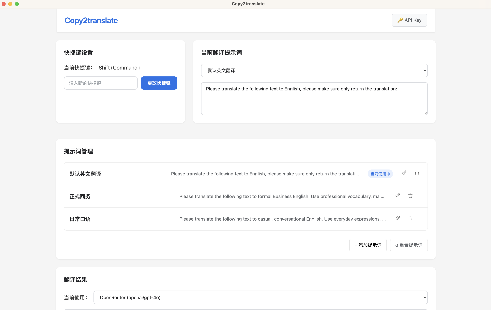

# Copy2Translate

[中文](#chinese) | [English](#english)

<a name="chinese"></a>
Copy2Translate 是一个简单高效的翻译工具，旨在通过复制文本和按下快捷键来简化翻译过程。无论您是学生、专业人士，还是经常需要翻译的人，Copy2Translate 都能简化流程，为您节省时间和精力。

## 功能特点

- **快捷键翻译**: 通过简单的快捷键组合即可快速翻译文本，提升工作效率。
- **多种翻译提示词**: 支持多种预设翻译提示词，满足不同场景的翻译需求。
- **OpenRouter API 支持**: 利用 OpenRouter API 提供的强大翻译能力。
- **DeepSeek API 支持**: 集成 DeepSeek API，提供更精准的翻译结果。
- **自动复制到剪贴板**: 翻译结果自动复制到剪贴板，方便后续使用。





## 开发环境设置

如果您想在本地开发或修改此项目，请确保已安装 Node.js 和 npm。然后按照以下步骤操作：

1. 克隆仓库
   ```bash
   git clone https://github.com/LizabethLi/Copy2Translate.git
   cd copy2translate
   ```

2. 安装依赖
   ```bash
   npm install
   ```

3. 运行程序
   ```bash
   npm start
   ```
   

4. 构建应用(如果想要自己封装成应用)
   ```bash
   npm run dist:mac    # 仅构建 macOS
   npm run dist:win    # 仅构建 Windows
   ```

## 软件安装说明（如果自己封装成了应用，或者获取了已经封装好的应用）

### Windows 用户
1. 下载最新的 `Copy2Translate-Setup.exe`
2. 双击运行安装程序
3. 按照提示完成安装

### macOS 用户
1. 下载最新的 `Copy2Translate.dmg`
2. 双击打开 DMG 文件
3. 将 `Copy2Translate.app` 拖到 `Applications` 文件夹

> **注意**：由于应用未经 Apple 开发者签名认证，macOS 可能会阻止应用运行。
> 
> **解决方法 1 (推荐):** 首次运行时，按住 `Control` 键点击应用图标，然后选择"打开"。在弹出的对话框中再次点击"打开"。之后就可以正常启动了。或者，前往"系统设置" > "隐私与安全性"，向下滚动找到相关提示，并点击"仍要打开"。
> 
> **解决方法 2 (终端命令):** 如果您熟悉终端，可以将应用拖入 `Applications` 文件夹后，打开"终端"应用，执行以下命令（需要输入您的 Mac 密码）：
> ```bash
> sudo xattr -rd com.apple.quarantine /Applications/Copy2Translate.app
> ```
> 这会移除应用的隔离属性，之后即可双击打开。
> 
> 作为开发者，我对使用此应用可能产生的任何风险不承担责任。如果您遇到安装或运行问题，请通过提交 [GitHub Issue](https://github.com/LizabethLi/Copy2Translate/issues) 来报告。


## 使用方法

1. 首次运行时，需要设置 API Key
2. 默认快捷键为 `Command+Shift+T`（macOS）或 `Ctrl+Alt+T`（Windows/Linux）
3. 选中要翻译的文本并复制
4. 按下快捷键即可翻译
5. 翻译结果会自动复制到剪贴板，直接粘贴即可，不需要离开当前的编辑页面


## API 密钥申请


### OpenRouter API 申请步骤
1. 访问 [OpenRouter 官网](https://openrouter.ai/)
2. 注册并登录您的账户
3. 导航到 API 密钥页面
4. 创建新的 API 密钥
5. 复制 API 密钥并添加到应用的设置中

### DeepSeek API 申请步骤
1. 访问 [DeepSeek 官网](https://platform.deepseek.com/)
2. 注册并登录您的账户
3. 导航到开发者或 API 页面
4. 申请 API 访问权限并创建密钥
5. 复制 API 密钥并添加到应用的设置中

## 配置说明

### API Key 设置
1. 点击顶部的 API Key 按钮
2. 选择翻译服务提供商
3. 输入对应的 API Key，填写模型名称，参见两个网站的模型卡
4. 点击保存

### 快捷键设置
1. 在设置界面中点击"更改快捷键"
2. 按下新的快捷键组合
3. 点击确认保存

### 翻译提示词
- 可以添加、编辑、删除翻译提示词
- 支持多种预设提示词模板
- 可以随时切换不同的翻译风格

## 商业使用与署名

本项目基于 MIT 许可证开源，您可以自由地使用、修改和分发，包括商业用途。

如果您计划将 Copy2Translate 用于商业产品或服务中，我们非常欢迎。

此外，如果您在商业项目或公开场合（如技术分享、博客文章等）使用了本项目的代码或设计，请考虑在适当的位置（例如项目文档、关于页面、致谢部分）提及本项目名称 (Copy2Translate) 并附上 GitHub 仓库链接 [https://github.com/LizabethLi/Copy2Translate](https://github.com/LizabethLi/Copy2Translate)。这不仅是对我们工作的认可，也有助于更多人发现和使用这个工具。

## 问题反馈

如果你在使用过程中遇到任何问题或有功能建议，请通过以下方式反馈：
1. 提交 [GitHub Issue](https://github.com/LizabethLi/Copy2Translate/issues) 


---

## English

Copy2Translate is a simple and efficient translation tool designed to streamline the translation process by copying text and pressing a hotkey. Whether you are a student, professional, or someone who frequently needs translations, Copy2Translate simplifies the workflow, saving you time and effort.

## Features

- **Hotkey Translation**: Quickly translate text with a simple hotkey combination, improving work efficiency.
- **Multiple Translation Prompts**: Supports multiple preset translation prompts to meet different translation needs in various scenarios.
- **OpenRouter API Support**: Utilizes the powerful translation capabilities provided by the OpenRouter API.
- **DeepSeek API Support**: Integrates DeepSeek API for more accurate translation results.
- **Automatic Copy to Clipboard**: Translation results are automatically copied to the clipboard for convenient subsequent use.


## Development Environment Setup

If you want to develop or modify this project locally, make sure you have Node.js and npm installed. Then follow these steps:

1. Clone the repository
   ```bash
   git clone https://github.com/LizabethLi/Copy2Translate.git
   cd copy2translate
   ```

2. Install dependencies
   ```bash
   npm install
   ```

3. Run the environment
   ```bash
   npm start
   ```

4. Build the application (if you want to package it yourself)
   ```bash
   npm run dist:mac    # Build for macOS only
   npm run dist:win    # Build for Windows only
   ```

## Software Installation Instructions (if you have packaged it yourself or obtained a pre-packaged application)

### Windows Users
1. Download the latest `Copy2Translate-Setup.exe`
2. Double-click to run the installer
3. Follow the prompts to complete the installation

### macOS Users
1. Download the latest `Copy2Translate.dmg`
2. Double-click to open the DMG file
3. Drag the application to the Applications folder

> **Note**: Since the application is not signed by an Apple developer, macOS may block the application from running.
> 
> **Solution 1 (Recommended):** When running for the first time, press the `Control` key while clicking the application icon, then select "Open". In the dialog that appears, click "Open" again. After that, you can start normally. Alternatively, go to "System Settings" > "Security & Privacy", scroll down to the relevant prompt, and click "Still Open".
> 
> **Solution 2 (Terminal Command):** If you are familiar with the terminal, you can drag the application to the "Applications" folder, then open the "Terminal" application, and execute the following command (you will need to enter your Mac password):
> ```bash
> sudo xattr -rd com.apple.quarantine /Applications/Copy2Translate.app
> ```
> This will remove the application's quarantine attribute, after which you can double-click to open it.
> 
> As a developer, I am not responsible for any risks associated with using this application. If you encounter installation or runtime issues, please report them by submitting a [GitHub Issue](https://github.com/LizabethLi/Copy2Translate/issues).

## Usage

1. When running for the first time, you need to set the API Key
2. The default hotkey is `Command+Shift+T` (macOS) or `Ctrl+Alt+T` (Windows/Linux)
3. Select the text you want to translate and copy it
4. Press the hotkey to translate
5. The translation result will be automatically copied to the clipboard, simply paste it without leaving the current editing page

## API Key Application

### OpenRouter API Application Steps
1. Visit the [OpenRouter official website](https://openrouter.ai/)
2. Register and log in to your account
3. Navigate to the API Key page
4. Create a new API Key
5. Copy the API Key and add it to the application settings

### DeepSeek API Application Steps
1. Visit the [DeepSeek official website](https://platform.deepseek.com/)
2. Register and log in to your account
3. Navigate to the Developer or API page
4. Apply for API access and create a key
5. Copy the API key and add it to the application settings

## Configuration Instructions

### API Key Settings
1. Click the API Key button at the top
2. Select the translation service provider
3. Enter the corresponding API Key, fill in the model name, refer to the model cards of the two websites
4. Click Save

### Shortcut Key Settings
1. Click "Change Shortcut Key" in the settings interface
2. Press the new shortcut key combination
3. Click Confirm to save

### Translation Prompts
- You can add, edit, and delete translation prompts
- Supports various preset prompt templates
- You can switch between different translation styles at any time

## Commercial Use and Attribution

This project is open-sourced under the MIT license, and you are free to use, modify, and distribute it, including for commercial purposes.

If you plan to use Copy2Translate in a commercial product or service, we highly welcome it.

Additionally, if you use the code or design of this project in a commercial project or public setting (such as technical sharing, blog articles, etc.), please consider mentioning the project name (Copy2Translate) and including a link to the GitHub repository [https://github.com/LizabethLi/Copy2Translate](https://github.com/LizabethLi/Copy2Translate) in an appropriate location (such as project documentation, about page, acknowledgments section). This not only recognizes our work but also helps more people discover and use this tool.

## Feedback

If you encounter any problems during use or have feature suggestions, please provide feedback through the following methods:
1. Submit a [GitHub Issue](https://github.com/LizabethLi/Copy2Translate/issues) 


